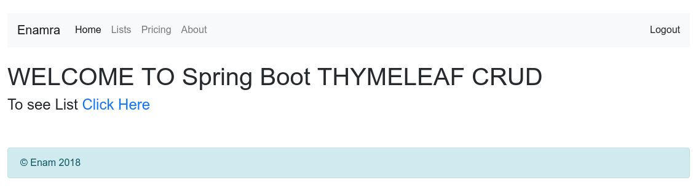
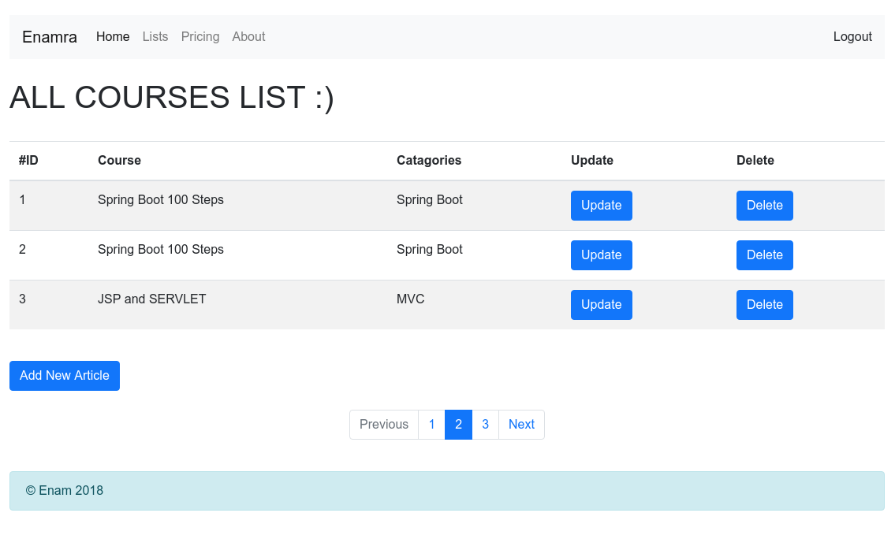
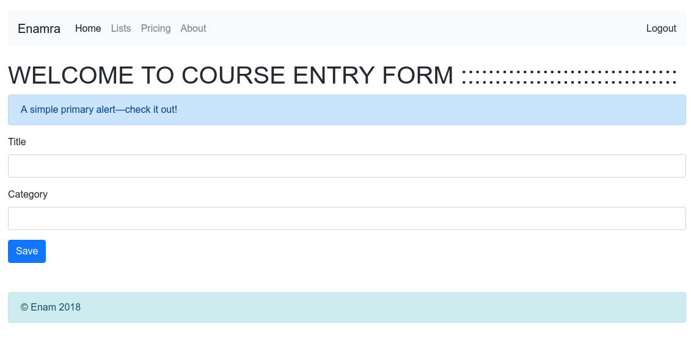
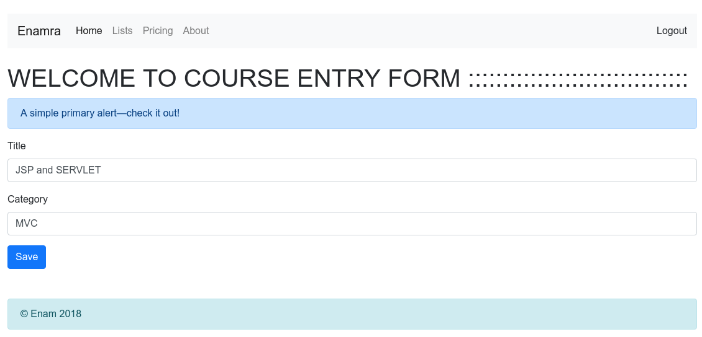

# spring-boot-CRUD-with-thymeleaf

  

spring boot thymeleaf CRUD example.
create Database crud_101 in mysql.

set MYSQL user and password in application.properties file.

Run: localhost:8080

# Welcome Page

  
  
  
# Main Page
  
  
# Add Course 
  
  
# Update Course
  
  
  

